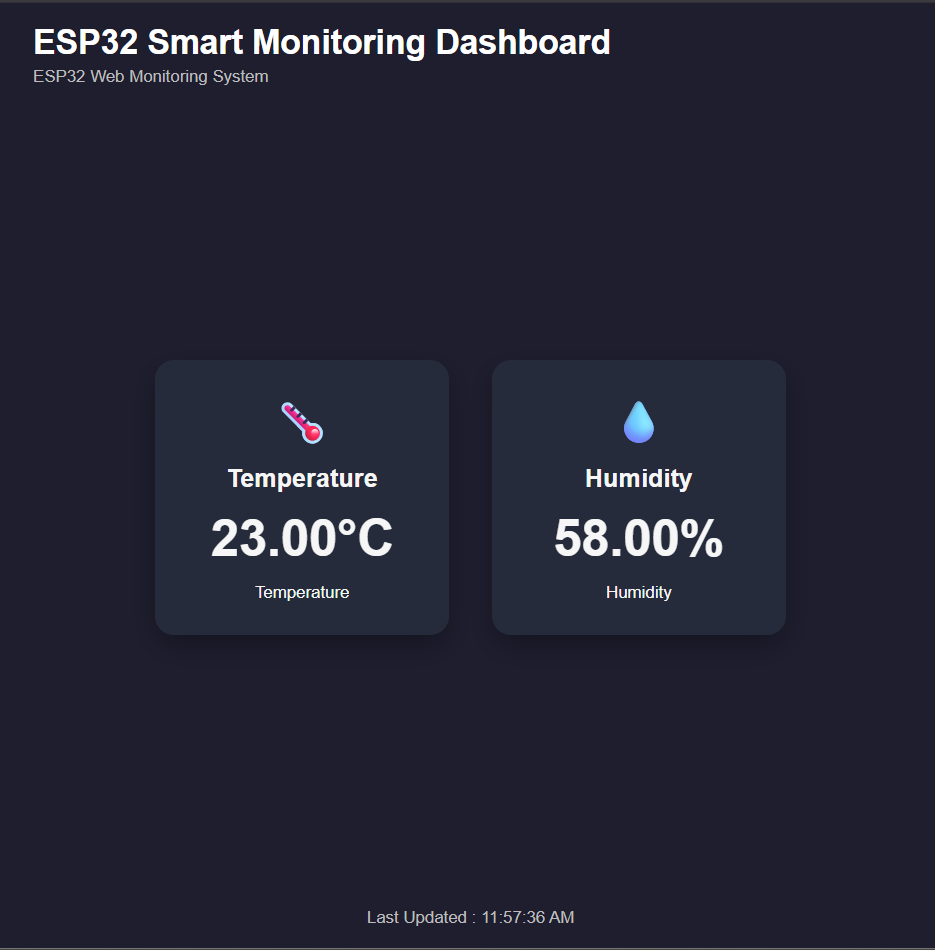
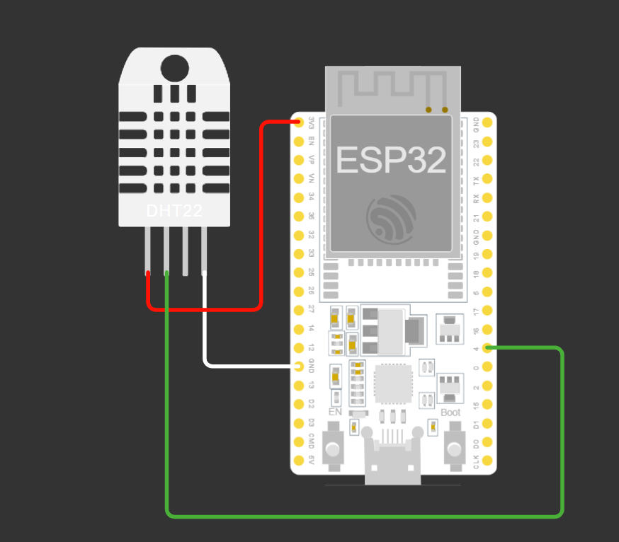
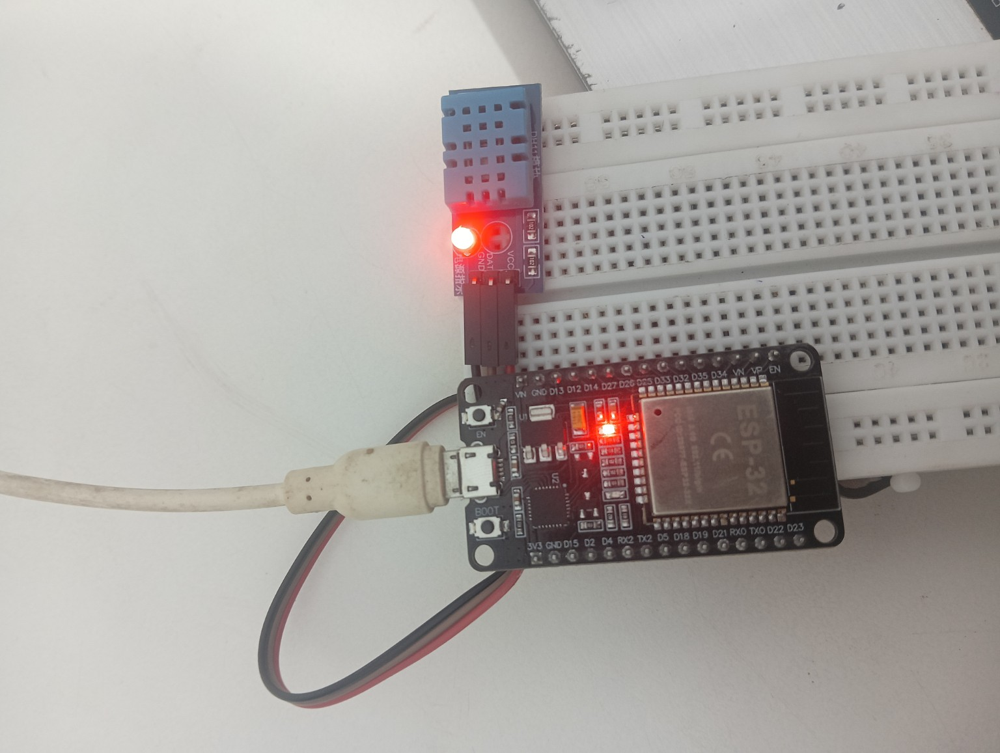

# ESP32-Smart-Temperature-Humidity-Monitoring-System
ESP32-based IoT temperature monitoring system with a real-time web dashboard using Arduino IDE, ESP32, DHT11, HTML, CSS and JavaScript.

## Dashboard Preview

<p align="center">
  
</p>

## Circuit Diagram

<p align="center">
  
</p>

## Hardware Setup

<p align="center">
  
</p>

## Features

• Real-time Temperature Monitoring
• Real-time Humidity Monitoring
• Responsive Dark UI
• mDNS Support (espbyrohit.local)
• Auto Data Refresh
• ESP32 Web Server
• Clean & Minimal Dashboard
• Mobile Friendly

## Hardware Requirements

• ESP32
• DHT11 / DHT22
• Breadboard
• Jumper Wires
• USB Cable


## Software Used

• HTML5
• CSS3
• JavaScript
• Arduino IDE

## Hardware Connections

| DHT11 Pin | ESP32 Pin |
|------------|-----------|
| VCC | 3.3V |
| GND | GND |
| DATA | GPIO 4 |

## Libraries Used

- WiFi.h
- WebServer.h
- LittleFS.h
- FS.h
- ESPmDNS.h
- DHT.h

## Getting Started

1. Install Arduino IDE.
2. Install the ESP32 Board Package (v2.0.16 recommended).
3. Install all required libraries.
4. Create a `data` folder and place:
   - index.html
   - style.css
   - script.js
5. Upload the LittleFS filesystem.
6. Upload the sketch to the ESP32.
7. Connect to the same Wi-Fi network.
8. Open:

```
http://espbyrohit.local
```

## Project Structure

```
ESP32-Smart-Temperature-Humidity-Dashboard
│
├── Code
│   ├── ESP32_TempHum_Dashboard.ino
│   └── data
│       ├── index.html
│       ├── style.css
│       └── script.js
│
├── Images
│   ├── dashboard.png
│   ├── circuit.png
│   ├── hardware.jpg
│   └── dashboard_demo.gif
└── README.md
```

## Author

```
Rohit Chaudhary

Engineering Student | IoT & Embedded Systems Enthusiast

```
GitHub: https://github.com/rohitchaudhary6102004-ux


